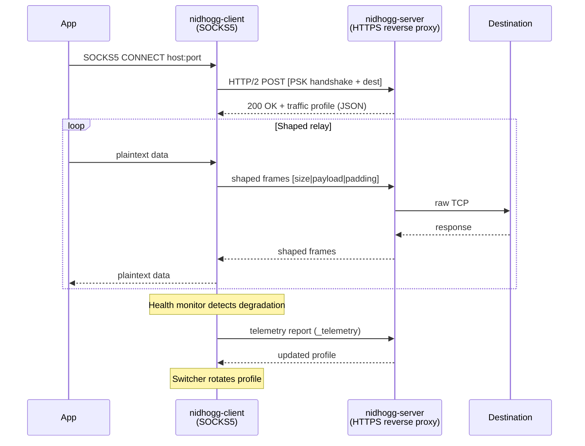

# Nidhogg

Adaptive anti-censorship transport with traffic shaping over HTTP/2.

[](https://go.dev)
[](LICENSE)

## What is Nidhogg?

Nidhogg tunnels network traffic through an HTTPS reverse proxy using HTTP/2 POST streams. It captures real HTTPS traffic profiles and applies adaptive packet shaping to make tunneled connections indistinguishable from legitimate web browsing. When a traffic profile degrades, the system automatically switches to an alternative profile without dropping active connections.

**Key features:**

- HTTP/2 POST streaming tunnel over TLS
- Adaptive traffic shaping from real HTTPS profiles (CDF-based packet sizing and timing)
- uTLS fingerprint randomization (Chrome, Firefox, Safari, or random)
- PSK-authenticated handshake (HMAC-SHA256)
- Automatic profile rotation on connection degradation
- Per-connection health monitoring with server telemetry feedback
- Server appears as a normal HTTPS reverse proxy to external observers

## How it works



## Quick start

### Prerequisites

- Go 1.22+
- A server with a public IP and domain (for production)

### Build

```bash
go build -o nidhogg-server ./cmd/nidhogg-server
go build -o nidhogg-client ./cmd/nidhogg-client
```

### Server setup

Create `config.json`:

```json
{
  "listen": ":443",
  "domain": "your-domain.com",
  "psk": "your-secret-key",
  "proxy_to": "https://example.com",
  "profile_targets": ["google.com"],
  "log_level": "info"
}
```

```bash
./nidhogg-server -config config.json
```

The server obtains a TLS certificate via Let's Encrypt automatically. For manual certificates, set `cert_file` and `key_file`.

### Client setup

Create `client.json`:

```json
{
  "server": "your-domain.com:443",
  "psk": "your-secret-key",
  "listen": "127.0.0.1:1080",
  "shaping_mode": "balanced",
  "log_level": "info"
}
```

```bash
./nidhogg-client -config client.json
```

Configure your browser or application to use `127.0.0.1:1080` as a SOCKS5 proxy.

## Configuration

### Server

| Field | Type | Default | Description |
|-------|------|---------|-------------|
| `listen` | string | `":443"` | Listen address |
| `domain` | string | required* | Domain for Let's Encrypt |
| `psk` | string | required | Pre-shared key for tunnel authentication |
| `proxy_to` | string | required | Reverse proxy target URL |
| `tunnel_path` | string | `"/"` | HTTP path for tunnel endpoint |
| `cert_file` | string | | TLS certificate file (alternative to Let's Encrypt) |
| `key_file` | string | | TLS private key file |
| `profile_targets` | []string | `["google.com"]` | Target sites for traffic profile generation |
| `profile_interval` | string | `"6h"` | Profile regeneration interval |
| `profile_min_snapshots` | int | `20` | Minimum traffic snapshots before regeneration |
| `telemetry_critical_threshold` | int | `3` | Critical reports before triggering profile regeneration |
| `log_level` | string | `"info"` | Log level: debug, info, warn, error |

*Required when `cert_file` is not set.

### Client

| Field | Type | Default | Description |
|-------|------|---------|-------------|
| `server` | string | required | Server address (host:port) |
| `psk` | string | required | Pre-shared key (must match server) |
| `listen` | string | `"127.0.0.1:1080"` | SOCKS5 proxy listen address |
| `tunnel_path` | string | `"/"` | Tunnel endpoint path (must match server) |
| `insecure` | bool | `false` | Skip TLS certificate verification |
| `fingerprint` | string | `"randomized"` | TLS fingerprint: randomized, chrome, firefox, safari |
| `shaping_mode` | string | `""` | Traffic shaping mode (see below) |
| `log_level` | string | `"info"` | Log level: debug, info, warn, error |
| `max_rtt_ms` | int | `2000` | Maximum handshake RTT before critical (ms) |
| `consecutive_failures` | int | `3` | Write errors before marking connection critical |
| `telemetry_interval` | string | `"30s"` | Health telemetry reporting interval |

### Shaping modes

| Mode | Description |
|------|-------------|
| *(empty)* | No shaping, raw relay |
| `stream` | Padding only &mdash; fixed frame sizes, no timing changes |
| `balanced` | Padding + burst pattern emulation |
| `stealth` | Padding + bursts + inter-packet timing delays from profile CDF |

## Architecture

Nidhogg is organized into focused internal packages:

| Package | Purpose |
|---------|---------|
| `transport` | TLS dialing with uTLS, PSK handshake generation/validation |
| `shaper` | Traffic shaping: frame encoding, CDF sampling, burst emulation |
| `profile` | Profile definition, generation from traffic snapshots, LRU cache |
| `pcap` | Traffic recording from real HTTPS connections |
| `health` | Per-connection monitoring, degradation detection, aggregate tracking |
| `telemetry` | Client-to-server health reporting, server-side aggregation |
| `switcher` | Profile cache with atomic switching and callbacks |
| `logging` | Structured logging setup (`log/slog`) |

See [docs/architecture.md](docs/architecture.md) for protocol details and design decisions.

## Roadmap

See [docs/roadmap.md](docs/roadmap.md) for planned features: Xray-core and sing-box integration, security hardening, connection pooling, local bypass, and release plans.

## Security

See [SECURITY.md](SECURITY.md) for the security model, known limitations, and how to report vulnerabilities.

## Contributing

See [CONTRIBUTING.md](CONTRIBUTING.md) for development setup and contribution guidelines.

## License

Nidhogg is licensed under the [GNU General Public License v3.0](LICENSE).
